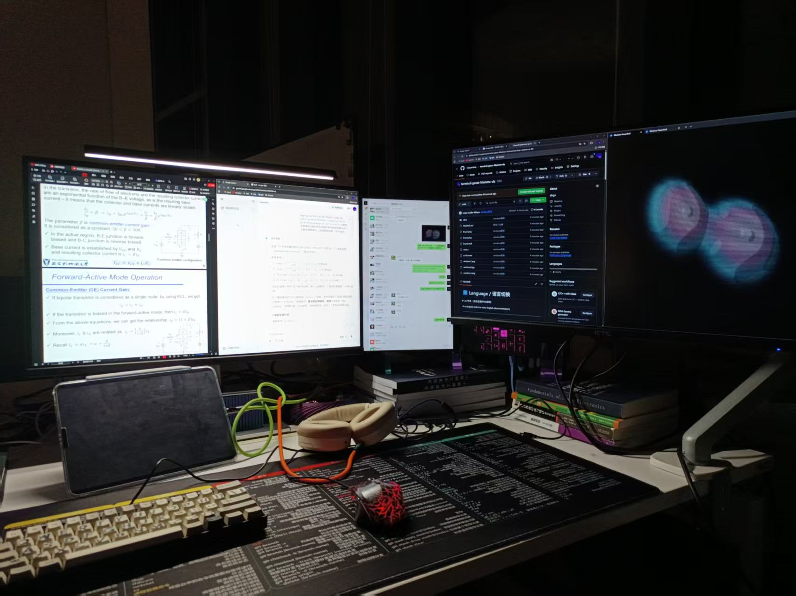
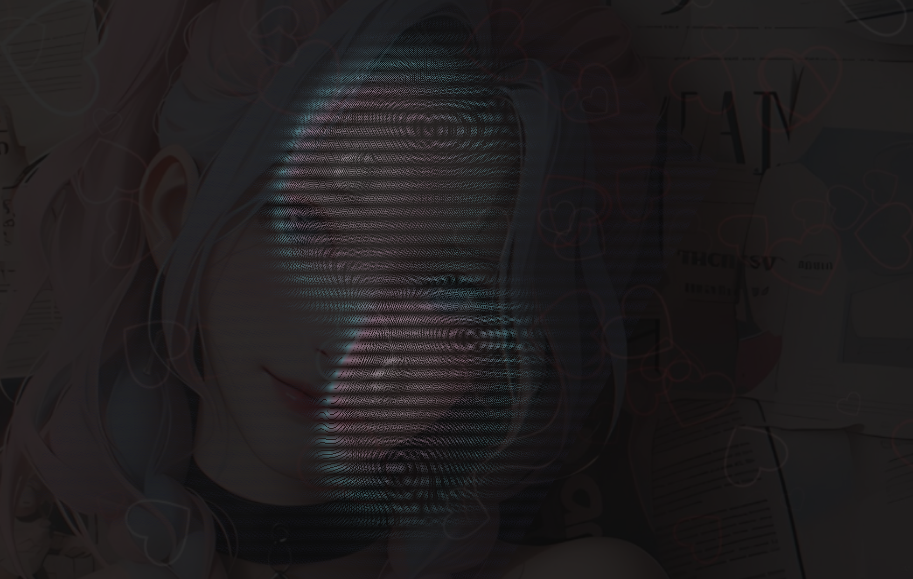
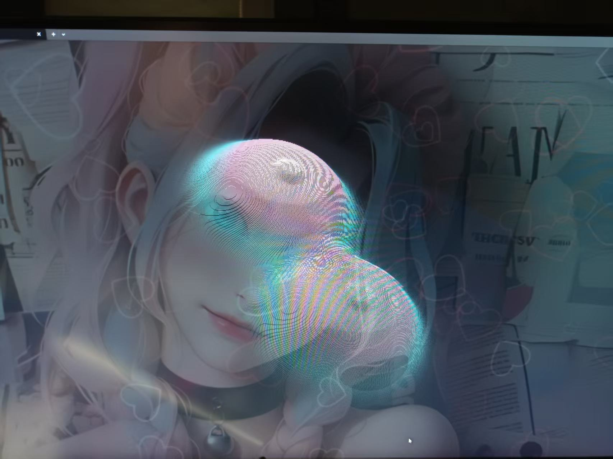
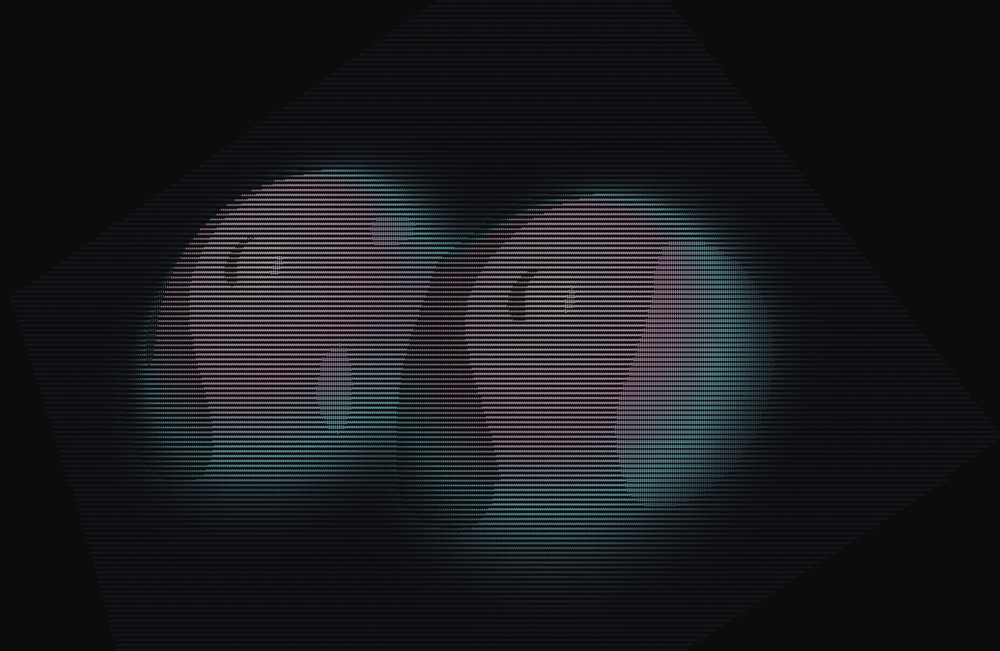

# 赛博mummy（doge）
当你进行疲劳的编码工作时，终端中出现一只可爱的赛博mummy（doge）会让你感到轻松愉快！它不仅能渲染高分辨率的函数图像，还能为你的编程时光增添一丝乐趣。快来试试吧！

when you are doing tiring coding work, having a cute cyber mummy (doge) appear in your terminal can make you feel relaxed and happy! It can not only render high-resolution function images but also add a touch of fun to your programming time. Give it a try!

<div align="center">
  
</div>

<!-- Language toggle: click a summary to expand the language you want. -->
## 🔀 Language / 语言切换

<details>
<summary>🇨🇳 中文（点此查看中文说明）</summary>

---

# 赛博mummy（doge） — 可用于实现终端渲染高分辨率的任意函数图像 🐶

赛博mummy（doge）是一个跨平台、无外部依赖的 C 工具，旨在在终端中以高分辨率渲染任意函数（例如 z = f(x, y)）生成的图像。项目同时支持 TrueColor 与 ASCII 混合着色，方便在不同终端上展示细节与色彩。

---

## 概述 🔎

渲染器在一个二维区域内采样，评估高度函数 z = f(x, y)，将得到的 3D 点用透视投影和 z-buffer 投影到终端空间。它结合 ASCII 字符密度与 24 位颜色（TrueColor）来产生具有深度和光照提示的混合着色效果。

默认曲面是一个复合高斯函数（类似“孪生山”），非常适合展示梯度和光照效果。

---

## 主要特性 ✨

- 自适应分辨率：根据终端大小调整采样密度以保持清晰度。
- TrueColor 渲染：使用 ANSI 24-bit 颜色序列输出平滑渐变。
- 混合着色：使用 ASCII 字符提供纹理/亮度提示，同时用 RGB 颜色表现高度/材质。
- 跨平台：支持类 Unix（ioctl + unistd）和 Windows（WinAPI + 虚拟终端处理）。
- 高性能：使用自定义 z-buffer 与一次性缓冲输出（fwrite）减少闪烁并提高吞吐。

---

## 数学部分 📐

渲染器可视化的高度场为两个高斯类峰值的组合，代码中实现为：

```
f(x, y) = exp(-r1^4 / 1000) + exp(-r2^4 / 1000)
        + 0.1 * exp(-r1^4) + 0.1 * exp(-r2^4)
```

其中

```
r1^2 = (x - 4)^2 + (y - 4)^2
r2^2 = (x + 4)^2 + (y + 4)^2
```

要点：
- `r1^4` 表示 `(r1^2)^2`；`/1000` 的项使峰更宽更平滑，`0.1*exp(-r^4)` 则在峰附近添加更窄更小的细节。
- 对光照进行法线估计时使用中心差分，法线（未归一化）为 `(-df_dx, -df_dy, 1)`，记得归一化后再用于漫反射/镜面反射计算。
- 投影时常用的参数包括 `Z_SCALE`（高度缩放）、`K1`（投影尺度）和 `camera_distance`（相机距离），这些参数可以一起调节以增强立体感。

---

## 构建与运行 🛠

### 先决条件

- GCC（Windows 下建议使用 MinGW-w64）

### Linux / WSL

```bash
# 编译（链接数学库）
gcc main.c -o surface -lm
# 运行
./surface
```

### Windows (PowerShell / CMD)

```powershell
# 编译
gcc main.c -o surface.exe
# 运行
.\surface.exe
```

提示：为了获得最佳视觉效果，请全屏运行、调小终端字体并使用支持 TrueColor 的终端（如 Windows Terminal）。

---

## 自定义 🔧

- 几何形状：修改 `main.c` 中的 `float func(float x, float y)`。
- 颜色方案：修改 `get_color` 或相关的颜色映射函数。
- 光照：调整光源位置、强度或着色模型（环境/漫反射/镜面）。
- 采样与尺度：修改采样范围/步长、投影缩放 `K1`、相机距离与 `Z_SCALE` 来控制立体感与性能。

建议：增加 `K1` 或 `Z_SCALE`，或减小 `camera_distance` 可明显增强 3D 感；减小 `STEP` 可得到更平滑的表面但会降低帧率。

---

## 实现细节 🧭

渲染流程概述：

1. 网格扫描：在配置域内以一定步长遍历 (x, y)。
2. 曲面评估：计算 z = f(x, y)。
3. 法线估计：中心差分得到 df_dx、df_dy。 
4. 变换：对 3D 点做旋转以生成动画视角。 
5. 投影：执行透视投影并乘以缩放常数。 
6. Z-buffer：保持每个像素最近点用于遮挡。 
7. 着色：基于亮度选择 ASCII 字符，同时用 RGB 颜色表现高度与光照。 
8. 输出：用 ANSI 序列和一次性缓冲输出整帧。

---

## 截图与演示 🖼️🎬

示例：

<table>
  <tr>
    <td style="padding:8px">
      
      <div style="text-align:center; font-size:0.95em;">Linux — 视角 A</div>
    </td>
    <td style="padding:8px">
      
      <div style="text-align:center; font-size:0.95em;">Linux — 视角 B</div>
    </td>
  </tr>
  <tr>
    <td colspan="2" style="text-align:center; padding-top:10px;">
      <video src="linux3.mp4" controls style="max-width:640px; width:100%; height:auto;" poster="linux1.png">视频不可用，请下载：<a href="linux3.mp4">linux3.mp4</a></video>
    </td>
  </tr>
  <tr>
    <td style="padding:8px">
      
      <div style="text-align:center; font-size:0.95em;">Windows — 视角 A</div>
    </td>
    <td style="padding:8px">
      
      <div style="text-align:center; font-size:0.95em;">Windows — 视角 B</div>
    </td>
  </tr>
  <tr>
    <td colspan="2" style="text-align:center; padding-top:10px;">
      
      <div style="text-align:center; font-size:0.95em;">Windows — 视角 C</div>
    </td>
  </tr>
</table>

---

## 许可证 📝

MIT 许可证（详见仓库中的 `LICENSE`）。

</details>

<details open>
<summary>🇺🇸 English (click to view English documentation)</summary>

---

# Cyber Mummy (doge) — Terminal high-resolution function renderer 🐶

Cyber Mummy (doge) is a cross-platform, dependency-free C utility designed to render high-resolution images of arbitrary functions (for example, z = f(x, y)) directly in the terminal. It supports TrueColor and a hybrid ASCII+RGB output mode so you can preserve fine detail and color across different terminal environments.

---

## Overview 🔎

This lightweight renderer scans a 2D domain, evaluates a height function $z = f(x, y)$, and projects the resulting 3D points into terminal space using perspective projection and a z-buffer. It blends ASCII character density with 24-bit color (TrueColor) to produce hybrid shading with depth and lighting cues.

The default surface is a composite Gaussian function that resembles "Twin Peaks", well-suited to demonstrate gradient shading and lighting.

---

## Key Features ✨

- Adaptive resolution: adjusts sampling density based on terminal size for sharp output across different window sizes and font settings.
- TrueColor rendering: outputs 24-bit RGB via ANSI escape sequences for smooth gradients.
- Hybrid shading: uses ASCII characters for texture/lighting cues and RGB colors for depth/material shading.
- Cross-platform: supports Unix-like systems (ioctl + unistd) and Windows (WinAPI + Virtual Terminal processing).
- High performance: uses a custom z-buffer and double-buffered frame output (via fwrite) to reduce flicker and increase throughput.

---

## The Math 📐

The renderer visualizes a scalar height field z = f(x, y). The implementation uses a compact combination of two Gaussian-like peaks; written compactly this is:

```
f(x, y) = exp(-r1^4 / 1000) + exp(-r2^4 / 1000)
        + 0.1 * exp(-r1^4) + 0.1 * exp(-r2^4)
```

where `r1` and `r2` are radial distances from two centers:

```
r1^2 = (x - 4)^2 + (y - 4)^2
r2^2 = (x + 4)^2 + (y + 4)^2
```

Notes and intuition:
- `r1^4` means `(r1^2)^2`. The `/1000` in the first two terms makes those bumps broad and smooth; the `0.1 * exp(-r^4)` terms add small, narrow detail near the peaks.
- The combination produces two offset hills with smooth gradients — a good target for finite-difference normal estimation and lighting.

Normal estimation (for lighting)

To compute lighting we need a surface normal at each sampled (x, y). The code estimates partial derivatives with a centered finite difference using a small epsilon ε:

```
df_dx ≈ (f(x + ε, y) - f(x - ε, y)) / (2ε)
df_dy ≈ (f(x, y + ε) - f(x, y - ε)) / (2ε)
```

An (unnormalized) object-space normal is then

```
N = (-df_dx, -df_dy, 1)
```

Normalize `N` before using it in dot products for diffuse/specular lighting. Recommended ε values are small but not too tiny — typical choices are in the range 1e-2 .. 2e-1 depending on sampling `STEP` (match ε roughly to your sampling distance to avoid numerical noise).

Projection and common constants

After computing the 3D point (x, y, z = f(x,y)), the renderer typically
1) optionally scales the height: z' = z * Z_SCALE,
2) applies rotations (pitch/yaw) to x,y,z', and
3) performs a simple perspective projection. A common projection form used in this project is:

```
ooz = 1.0 / (z_rotated + camera_distance)
xp = X_CENTER + K1 * ooz * x_rotated
yp = Y_CENTER - K1 * ooz * y_rotated
```

where `K1` is a projection scale, `camera_distance` avoids division by zero and controls perspective strength, and `(X_CENTER, Y_CENTER)` are the terminal's center coordinates.

Tuning for stronger 3D effect

- Increase `Z_SCALE` to exaggerate vertical differences.
- Increase `K1` to amplify projected offsets on screen.
- Decrease `camera_distance` to strengthen perspective (but beware of clipping when camera_distance is too small).
- Reduce sampling `STEP` for a finer mesh (costs CPU). Keep the finite-difference ε on the same order as `STEP` for stable normals.

See `main.c` for the exact constants and sampling domain used in your build. Adjust the constants there to experiment with the visual effect.

---

## Build & Run 🛠

### Prerequisites

- GCC (MinGW-w64 on Windows, standard GCC on Linux/WSL)

### Linux / WSL

```bash
# Compile (link math library)
gcc main.c -o surface -lm
# Run
./surface
```

### Windows (PowerShell / CMD)

```powershell
# Compile
gcc main.c -o surface.exe
# Run
.\surface.exe
```

Tip: For the best visual result, run in full-screen, lower the terminal font size (Ctrl + Scroll), and use a TrueColor-capable terminal emulator.

---

## Customization 🔧

- Geometry: edit `float func(float x, float y)` in `main.c` to render different surfaces.
- Color scheme: adjust the color-mapping function (e.g. `get_color` or `get_hybrid_color`) to change palettes.
- Lighting: change light position/intensity or shading model (ambient/diffuse/specular) to alter surface appearance.
- Sampling and scale: tweak sampling range/step, projection scale (K1), camera distance, and z-scale to increase/decrease perceived depth and smoothness.

Suggested knobs to tweak for stronger 3D effect:
- Increase projection scale (K1) and z-scale to exaggerate depth.
- Decrease camera distance to bring the surface closer to the camera.
- Reduce sampling `STEP` for a finer mesh (at the cost of performance).

---

## Implementation Details 🧭

Rendering pipeline summary:

1. Grid scanning: iterate (x, y) over a configurable domain with a step size (sampling density).
2. Surface evaluation: compute $z = f(x, y)$.
3. Normal estimation: finite differences (central difference) to get surface normals for lighting.
4. Transform: rotate the 3D point (pitch & yaw) to create animation and different views.
5. Projection: project rotated 3D points into 2D terminal coordinates using perspective
   (typically multiplying by a constant and dividing by $z$ + camera distance).
6. Z-buffering: keep the nearest point per cell to handle occlusion.
7. Shading: combine ASCII character selection (by brightness) and RGB color (by height + lighting).
8. Output: build a single frame string with ANSI color escapes and write with `fwrite`.

---

## Tips & Troubleshooting 🛟

- If colors look wrong on Windows CMD, ensure Virtual Terminal processing is enabled or use a terminal that supports TrueColor (Windows Terminal, ConEmu, etc.).
- For slow machines, increase `STEP` to reduce sample count or reduce terminal size.
- If the surface clips or appears too flat, increase `Z_SCALE` or reduce `CAMERA_DIST`.

---

## Screenshots & Demo 🖼️🎬

Examples:

<table>
  <tr>
    <td style="padding:8px">
      
      <div style="text-align:center; font-size:0.95em;">Linux — view A</div>
    </td>
    <td style="padding:8px">
      
      <div style="text-align:center; font-size:0.95em;">Linux — view B</div>
    </td>
  </tr>
  <tr>
    <td colspan="2" style="text-align:center; padding-top:10px;">
      <video src="linux3.mp4" controls style="max-width:640px; width:100%; height:auto;" poster="linux1.png">Video not available, download: <a href="linux3.mp4">linux3.mp4</a></video>
    </td>
  </tr>
  <tr>
    <td style="padding:8px">
      
      <div style="text-align:center; font-size:0.95em;">Windows — view A</div>
    </td>
    <td style="padding:8px">
      
      <div style="text-align:center; font-size:0.95em;">Windows — view B</div>
    </td>
  </tr>
  <tr>
    <td colspan="2" style="text-align:center; padding-top:10px;">
      
      <div style="text-align:center; font-size:0.95em;">Windows — view C</div>
    </td>
  </tr>
</table>

---

## License 📝

Distributed under the MIT License. See `LICENSE` for details.

</details>
